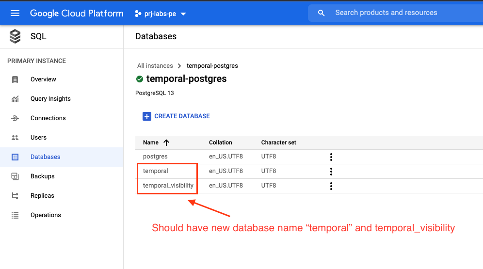

# Connecting GKE to Cloud SQL

1. [Create Google Service Account with role Cloud SQL Client](#create-google-service-account-with-role-cloud-sql-client)
2. [Enable Cloud SQL Admin API](#enable-cloud-sql-admin-api)
3. [Create PostgreSQL database user](#create-postgresql-database-user)
4. [Setup helm value for PostgreSQL](#setup-helm-value-for-postgresql)
5. Setup sidecar container with Workload Identity or Service Account Key
    - **Workload Identity** - see [Sidecar connect Cloud SQL using Workload Identity](#sidecar-connect-cloud-sql-using-workload-identity)
    - **Service Account Key** - see [Sidecar connect Cloud SQL using Google Service Account key](#sidecar-connect-cloud-sql-using-google-service-account-key)
6. [Create databases and namespace for Temporal workflow](#create-databases-and-namespace-for-temporal-workflow)
7. [Verify Temporal Dashboard](#verify-temporal-dashboard)

**Note**: [Changes from the original Helm chart](#note-changes-from-the-original-helm-chart)

[More information about connect GKE to Cloud SQL](https://cloud.google.com/sql/docs/postgres/connect-kubernetes-engine)

# Create Google Service Account with role Cloud SQL Client

1. Create service account `YOUR-GSA-NAME`@`PROJECT_ID`.iam.gserviceaccount.com on GCP console

    <br><br>

2. Add role Cloud SQL Client to service account
    
    <br>

# Enable Cloud SQL Admin API
<br><br>

# Create PostgreSQL database user

Create user for accessing Google cloud SQL instance from our apps<br>
<br><br>

# Setup helm value for PostgreSQL

Update file `values/values.postgresql.yaml`<br>
`host` to `127.0.0.1` to use proxy sidecar
`<DB_USER>` and `<DB_PASSWORD>` use from DB credential created when set up the PostgreSQL database user above.
```
server:
  config:
    persistence:
      default:
        driver: "sql"
        sql:
          driver: "postgres"
          host: 127.0.0.1
          port: 5432
          database: temporal
          user: <DB_USER>
          password: <DB_PASSWORD>
        
          ...

      visibility:
        driver: "sql"
        sql:
          driver: "postgres"
          host: 127.0.0.1
          port: 5432
          database: temporal_visibility
          user: <DB_USER>
          password: <DB_PASSWORD>
        
          ...
    ...
```

# Sidecar connect Cloud SQL using Workload Identity

A Google Service Account (GSA) is an IAM identity that represents your application in Google Cloud. In a similar fashion, a Kubernetes Service Account (KSA) is a an identity that represents your application in a Google Kubernetes Engine cluster.

Workload Identity binds a KSA to a GSA, causing any deployments with that KSA to authenticate as the GSA in their interactions with Google Cloud.

## Enable Workload Identity to our GKE

1. Modify the cluster with the following command:
    ```
    gcloud container clusters update CLUSTER_NAME --region=CLUSTER_REGION \
        --workload-pool=PROJECT_ID.svc.id.goog
    ```
    This command will take a several minutes to finish.


2. Modify an existing node pool to use the GKE metadata server.
    `NODEPOOL_NAME` is your node pool that run Temporal.
    `CLUSTER_NAME` is your GKE Cluster that run Temporal.
    ```
    gcloud container node-pools update NODEPOOL_NAME \
    --cluster=CLUSTER_NAME \
    --workload-metadata=GKE_METADATA
    ```

[More information about enable Workload Identity](https://cloud.google.com/kubernetes-engine/docs/how-to/workload-identity#enable_on_cluster)

## Enable the IAM binding between your YOUR-GSA-NAME and YOUR-KSA-NAME

`YOUR-KSA-NAME` is your GKE service account you provided in `values.cloudsqlproxy_workload_identity.yaml` field name `server.workloadIdentity.serviceAccountName`

`YOUR-GSA-NAME` is Google Service Account you create with role Cloud SQL Client in the GCP console

1. [Create Google Service Account with role Cloud SQL Client in GCP console](#create-google-service-account-with-role-cloud-sql-client)

2. Binding service account with following command:
```
gcloud iam service-accounts add-iam-policy-binding \
--role="roles/iam.workloadIdentityUser" \
--member="serviceAccount:PROJECT_ID.svc.id.goog[YOUR-K8S-NAMESPACE/YOUR-KSA-NAME]" \
YOUR-GSA-NAME@PROJECT_ID.iam.gserviceaccount.com
```

## Update file `values/values.cloudsqlproxy_workload_identity.yaml`

Update values to your environment values.

```
server:
  sidecarContainers:
    - name: cloud-sql-proxy
      image: gcr.io/cloudsql-docker/gce-proxy:1.17
      command:
        - "/cloud_sql_proxy"
        - "-instances=YOUR_CLOUD_SQL_CONNECTION_NAME=tcp:5432"
      securityContext:
        runAsNonRoot: true

  workloadIdentity:
    enabled: true
    serviceAccountName: YOUR-KSA-NAME
    googleServiceAccount: YOUR-GSA-NAME@PROJECT_ID.iam.gserviceaccount.com
```

## Deploy Temporal with Cloud SQL proxy using Workload Identity method

```
helm install \
    -f values/values.postgresql.yaml \
    -f values/values.cloudsqlproxy_workload_identity.yaml \
    --set server.replicaCount=1 \
    --set prometheus.enabled=false \
    --set grafana.enabled=false \
    --set elasticsearch.enabled=false \
    temporaltest . --timeout 900s
```

# Sidecar connect Cloud SQL using Google Service Account key

If you can't use Workload Identity, the recommended pattern is to mount a service account key file into the Cloud SQL Auth proxy pod and use the -credential_file flag

## Create K8S secret

1. Create JSON key for your service-accounts<br>Replace to `YOUR-GSA-NAME` and `PROJECT_ID` used to create in the first step.
    ```
    gcloud iam service-accounts keys create ~/key.json \
    --iam-account=YOUR-GSA-NAME@PROJECT_ID.iam.gserviceaccount.com
    ```

2. Create K8S secret named `YOUR-SA-SECRET` with filename `temporal.json` (this can be other names) and use key.json from the previous step.<br>
    ```
    kubectl create secret generic YOUR-SA-SECRET \
    --from-file=temporal.json=~/key.json

## Update file `values/values.cloudsqlproxy_service_account_key.yaml`

Update values to your environment values.

```
server:
  sidecarContainers:
    - name: cloud-sql-proxy
      image: gcr.io/cloudsql-docker/gce-proxy:1.17
      command:
        - "/cloud_sql_proxy"
        - "-instances=YOUR_CLOUD_SQL_CONNECTION_NAME=tcp:5432"
        - "-credential_file=/secret/temporal.json"
      securityContext:
        runAsNonRoot: true
      volumeMounts:
        - name: google-cloud-key
          mountPath: /secret/
          readOnly: true

  additionalVolumes:
    - name: google-cloud-key
      secret:
        secretName: YOUR-SA-SECRET

  workloadIdentity:
    enabled: false
```

## Deploy Temporal with Cloud SQL proxy using Service Account key

```
helm install \
    -f values/values.postgresql.yaml \
    -f values/values.cloudsqlproxy_service_account_key.yaml \
    --set server.replicaCount=1 \
    --set prometheus.enabled=false \
    --set grafana.enabled=false \
    --set elasticsearch.enabled=false \
    temporaltest . --timeout 900s
```

# Create databases and namespace for Temporal workflow

Install Temporal server with helm chart will not create default namespace.

1. Shell into `admin-tool` by 
    ```
    kubectl exec -it services/temporaltest-admintools /bin/bash
    ```
2. Export environment for connecting to the database instance.
    ```
    export SQL_PLUGIN=postgres
    export SQL_HOST=127.0.0.1
    export SQL_PORT=5432
    export SQL_USER=<DB_USER>
    export SQL_PASSWORD=<DB_PASSWORD>
    ```

2. Create database named `temporal` and its schema
    ```
    temporal-sql-tool create-database -database temporal
    SQL_DATABASE=temporal temporal-sql-tool setup-schema -v 0.0
    SQL_DATABASE=temporal temporal-sql-tool update -schema-dir schema/postgresql/v96/temporal/versioned
    ```

3. Create database named `temporal_visibility` and its schema
    ```
    temporal-sql-tool create-database -database temporal_visibility
    SQL_DATABASE=temporal_visibility temporal-sql-tool setup-schema -v 0.0
    SQL_DATABASE=temporal_visibility temporal-sql-tool update -schema-dir schema/postgresql/v96/visibility/versioned
    ```

4. Verify that there are two databases created for the instance.<br>
    

5. Wait until Temporal-Frontend run successfully then create namespace `<YOUR_NAMESPACE_NAME>`
    ```
    tctl --namespace <YOUR_NAMESPACE_NAME> namespace register
    ```

6. Verify namespace
    ```
    tctl --namespace <YOUR_NAMESPACE_NAME> namespace desc
    ```

# Verify Temporal Dashboard

1. Forward port for `temporal-web` so we can temporary access the temporal web.
    ```
    kubectl port-forward service/temporaltest-web 8088:8088
    ```

2. Open web browser and fill in `127.0.0.1:8088`

    


# Note: Changes from the original Helm chart

Original helm chart can be found here [https://github.com/temporalio/helm-charts](https://github.com/temporalio/helm-charts)

1. Update and split file `values.cloudsqlproxy.yaml` into two files to support
    - **Workload Identity** use `values.cloudsqlproxy_workload_identity.yaml`
    - **Service Account key file** use `values.cloudsqlproxy_service_account_key.yaml`
2. Add support Cloud SQL proxy sidecar to `admintools-deployment.yaml`
    ```
    {{ if $.Values.server.workloadIdentity.enabled }}
    serviceAccountName: {{ $.Values.server.workloadIdentity.serviceAccountName }}
    {{ end }}
    ```
    ```
    {{- if $.Values.server.sidecarContainers }}
    {{- toYaml $.Values.server.sidecarContainers | nindent 8 }}
    {{- end }}
    ```
    ```
    {{- if $.Values.server.sidecarContainers }}
    {{- if not $.Values.server.workloadIdentity.enabled }}
      volumes:
        {{- if $.Values.server.additionalVolumes }}
        {{- toYaml $.Values.server.additionalVolumes | nindent 8}}
        {{- end }}
    {{- end }}
    {{- end }} 
    ```
2. Add support Workload Identity Cloud SQL proxy sidecar to `server-deployment.yaml`
    ```
    {{ if $.Values.server.workloadIdentity.enabled }}
    serviceAccountName: {{ $.Values.server.workloadIdentity.serviceAccountName }}
    {{ end }}
    ```
    ```
    {{- if $.Values.server.sidecarContainers }}
    {{- if not $.Values.server.workloadIdentity.enabled }}
      volumes:
        {{- if $.Values.server.additionalVolumes }}
        {{- toYaml $.Values.server.additionalVolumes | nindent 8}}
        {{- end }}
    {{- end }}
    {{- end }} 
    ```
3. Add service account `service-account.yaml` for support Workload Identity
